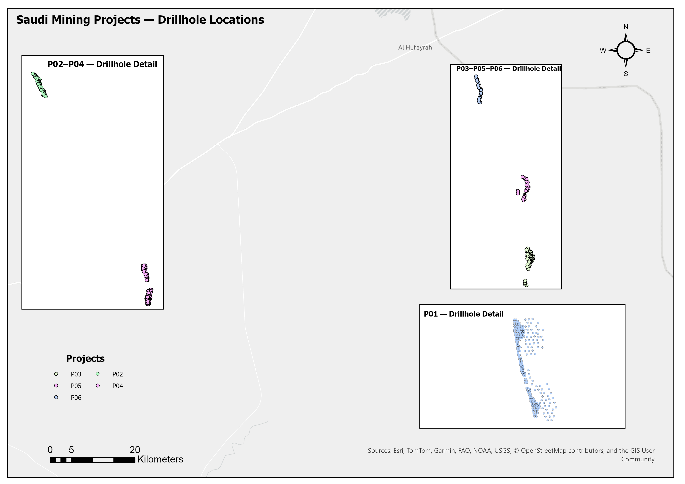
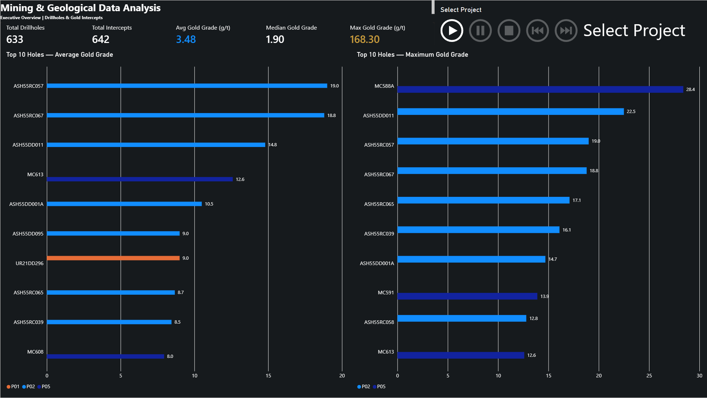
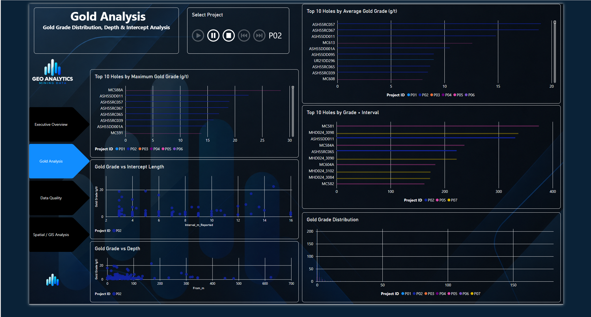
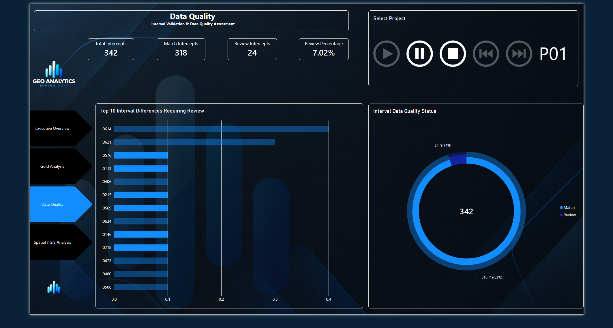
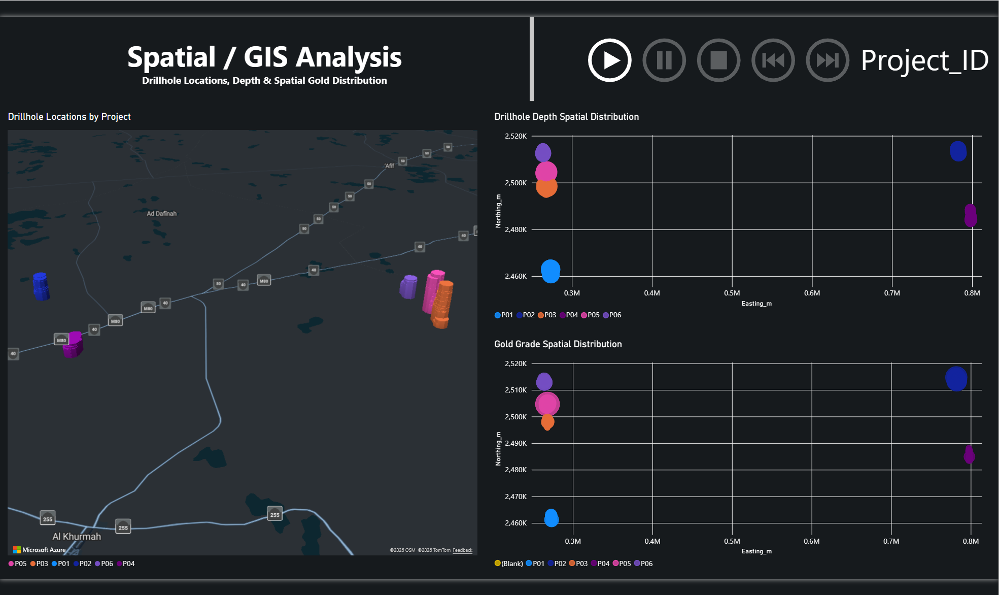

# Saudi Mining & Geology Data Analysis

An end-to-end mining and geological data analytics project integrating **Excel, MySQL, Power BI, and GIS** to analyze drillholes, gold intercepts, data quality, and spatial patterns.

## Project Overview

This project demonstrates a complete geological data workflow from raw drilling and assay data to an interactive analytical dashboard.

The workflow includes:

**Excel → MySQL → SQL Analysis → Power BI → GIS**

The analysis focuses on drillhole information, gold grades, mineralized intercepts, interval data quality, and spatial distribution across multiple mining projects in Saudi Arabia.

## Key Features

- Analysis of **712 source drillholes** and **642 gold intercepts**
- **633 drillholes (P01–P06)** included in geographic mapping; P07 was excluded because its local mine grid requires a valid coordinate transformation
- Relational data model linking Drillholes and Intercepts
- SQL analysis using JOIN, GROUP BY, aggregation, CASE, and Views
- Gold grade analysis using Average, Maximum, Median, and Grade × Interval
- Data quality validation comparing reported and calculated interval lengths
- Interactive project filtering and playback across mining projects
- Spatial analysis using Easting/Northing coordinates
- GIS visualization using converted WGS84 Latitude/Longitude coordinates
- Interactive Power BI dashboard with:
  - Executive Overview
  - Gold Analysis
  - Data Quality
  - Spatial / GIS Analysis

## Tools & Technologies

| Tool | Application |
|---|---|
| Microsoft Excel | Initial data review and preparation |
| MySQL | Relational database and data storage |
| SQL | Data validation, joins, aggregation, analysis, and views |
| Power BI | Data modeling, DAX measures, interactive analysis, and dashboard development |
| ArcGIS Pro | Spatial validation and GIS analysis |
| Power Query | Data transformation and preparation |

## Data Model

The Power BI data model uses a **One-to-Many (1:*) relationship** between:

- **Drillholes** — one record per drillhole/collar
- **Intercepts** — multiple geological intervals can belong to one drillhole

The tables are linked using **Collar_Record_ID**.

This structure allows drillhole attributes such as location, depth, and project information to filter and analyze the associated gold intercepts.

## SQL Analysis

SQL was used to validate, integrate, and analyze the geological dataset before visualization in Power BI.

Key SQL tasks included:

- Validating drillhole and intercept record counts
- Linking drillholes and gold intercepts using `Collar_Record_ID`
- Checking unmatched records using LEFT JOIN
- Calculating minimum, maximum, and average drillhole depths
- Identifying high-grade gold intercepts
- Aggregating gold results by drillhole
- Validating reported interval lengths against calculated intervals
- Creating data-quality flags using CASE statements
- Creating the `vw_gold_intercepts` view for integrated geological analysis.

## Power BI Dashboard

The interactive Power BI dashboard is organized into four analytical pages:

### 1. Executive Overview
Provides a high-level summary of drillholes and gold intercepts, including total drillholes, total intercepts, average gold grade, median gold grade, maximum gold grade, and Top 10 drillholes.

### 2. Gold Analysis
Explores gold mineralization using:
- Average and maximum gold grade by drillhole
- Grade × Interval analysis
- Gold Grade vs. Intercept Length
- Gold Grade vs. Depth
- Gold grade distribution

### 3. Data Quality
Evaluates interval consistency using:
- Match and Review classifications
- Review percentage
- Reported vs. calculated interval differences
- Identification of intervals requiring review

### 4. Spatial / GIS Analysis
Explores the spatial distribution of drillholes and gold grades using:
- Drillhole locations
- Drillhole depth
- Gold grade spatial distribution
- Easting/Northing coordinates
- WGS84 Latitude/Longitude mapping.

## Data Quality Results

Interval validation was performed by comparing the reported interval length with the calculated interval:

**Calculated Interval = To_m - From_m**

Using a tolerance of **0.01 m**, the validation identified:

- **610 Match records**
- **32 Review records**
- **642 Total Intercepts**
- Approximately **4.98%** of intercept records were flagged for review

This quality-control step helps identify interval records that may require further verification before geological interpretation or reporting.

## GIS & Coordinate Systems

The spatial component of the project required handling multiple coordinate reference systems across the mining projects.

- **P01, P03, P05, P06:** WGS 1984 UTM Zone 38N — EPSG:32638
- **P02, P04:** WGS 1984 UTM Zone 37N — EPSG:32637
- **P07:** Local mine grid; excluded from geographic mapping because a valid transformation is required

For Power BI mapping, valid UTM coordinates were transformed to **WGS84 Latitude/Longitude** for projects P01–P06.

The original Easting/Northing coordinates were retained for spatial analysis and validation.

### ArcGIS Pro — Drillhole Location Map

The final ArcGIS Pro layout visualizes the spatial distribution of drillholes across projects P01–P06, with detailed inset maps for clearer drillhole-level visualization.

### Executive Overview

### Gold Analysis

### Data Quality

### Spatial / GIS Analysis

## Project Workflow

**Raw Geological Data → Excel → MySQL → SQL Analysis & Data Quality → Power BI → GIS / Spatial Analysis**

## Author

**Mohammad Al-Madani**

Geology & Earth Sciences | GIS | Data Analytics | Data Governance.
